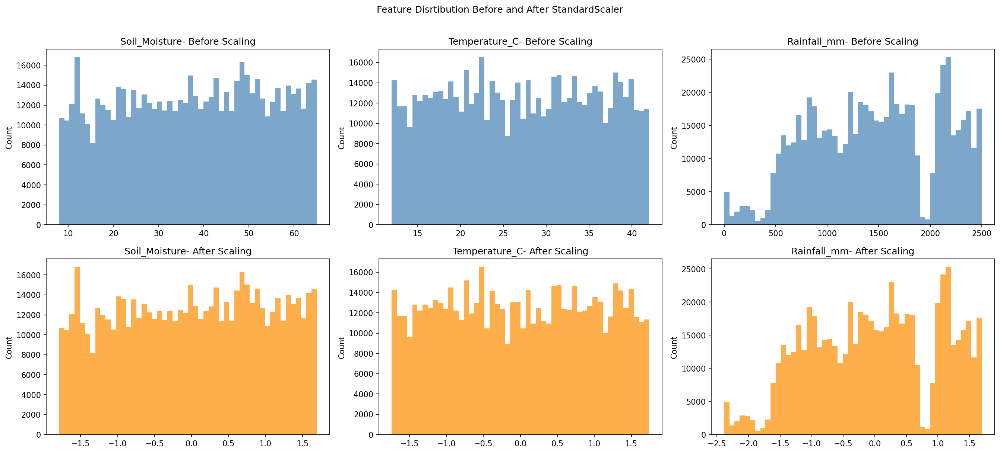
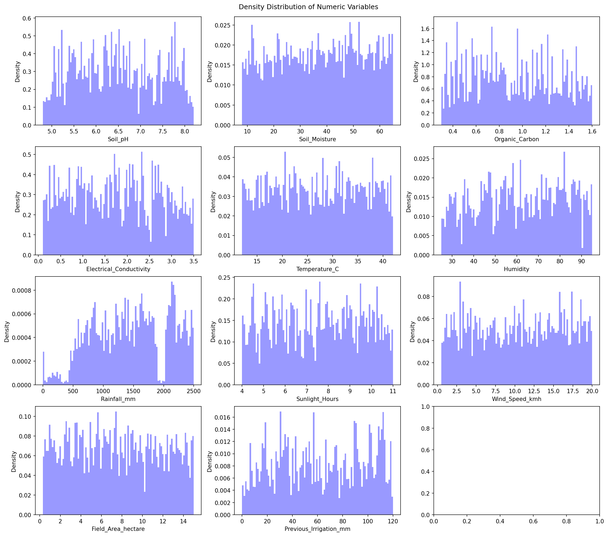
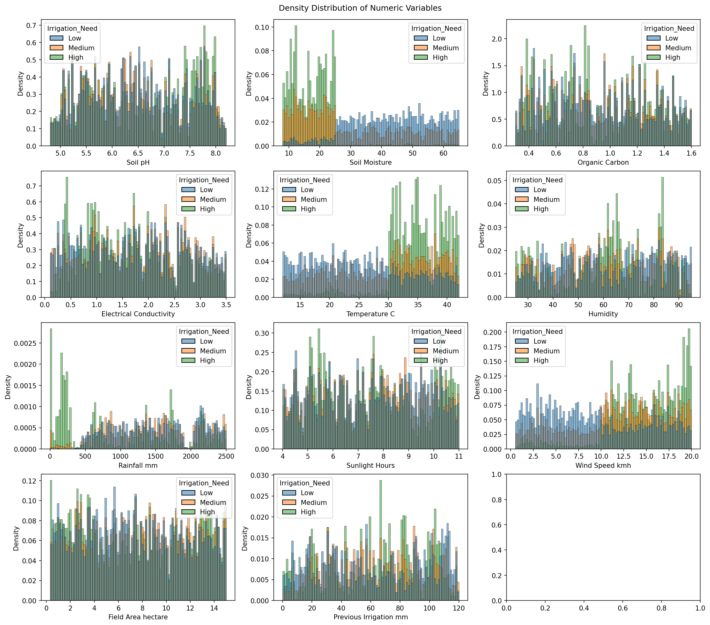
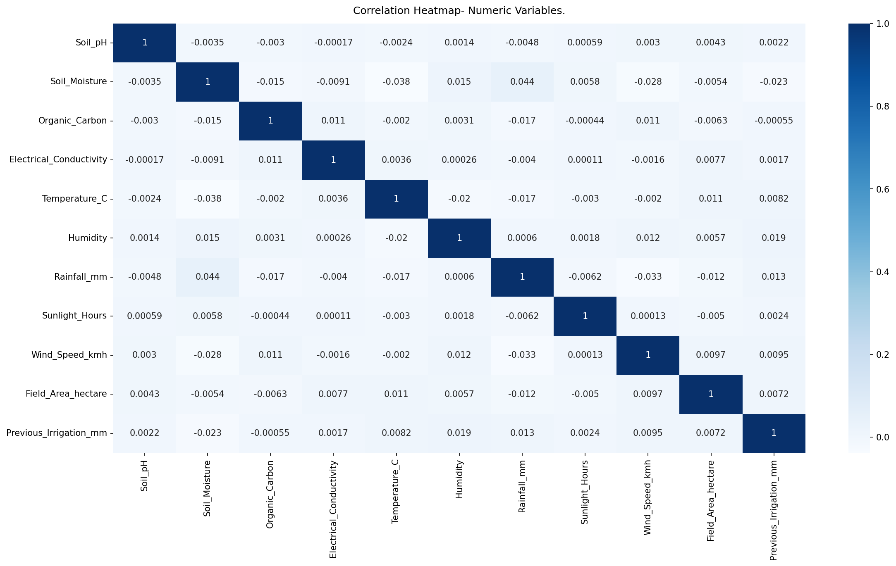
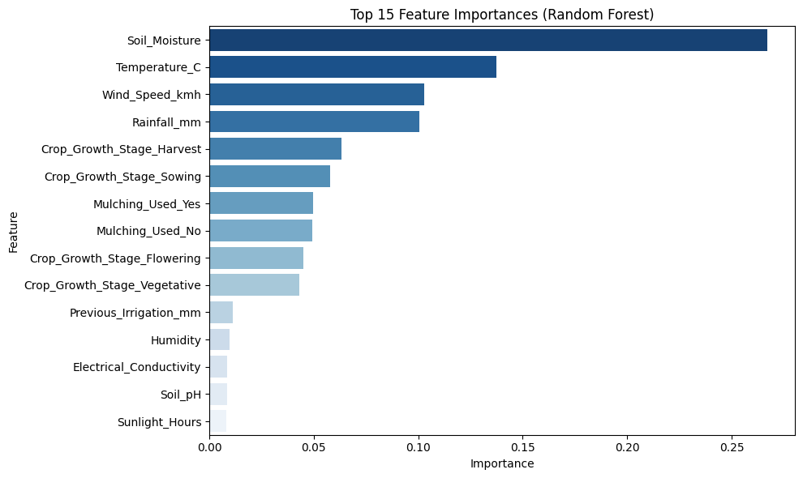

  

# Predicting Irrigation Need using Multi-Class ML Models
This project uses machine learning to predict the irrigation need level of agricultural fields (Low, Medium, or High) using environmental and agronomic features from a Kaggle tabular dataset.

## Overview
The goal of this project is to predict the irrigation needs of agricultural fields using environmental and agronomic features with supervised machine learning. The dataset, sourced from Kaggle, includes 630,000 records with 21 features such as Soil Moisture, Temperature, Rainfall, Crop Type, and Soil Type. The target variable is `Irrigation_Need.` (Low / Medium / High), making this a multi-class classification task.

A key challenge was significant class imbalance — the High class represented only 3.33% of records. This was addressed using `class_weight='balanced'` in the Random Forest classifier, which penalizes misclassification of minority classes more heavily during training without altering the dataset itself.

EDA revealed that Soil Moisture and Temperature were the strongest predictors, showing clear class separation, while most other features showed heavy overlap. This was later confirmed by the model's feature importance rankings. The final tuned Random Forest achieved a Kaggle Balanced Accuracy score of 0.96108, placing in the **Top 18%** out of 6,864 entrants.

## Summary of Work Done

### Data
- **Type:** CSV file from Kaggle
- **Input:** Environmental and agronomic features including Soil Moisture, Temperature, 
  Rainfall, Crop Type, Soil Type, Crop Growth Stage, and more
- **Output:** Multi-class label (`Irrigation_Need`) — Low, Medium, or High   
- **Size:** 630,000 records with 21 features
- **Split:**
  - 70% for training (441,000 samples)
  - 15% for validation (94,500 samples)
  - 15% for testing (94,500 samples)
  - Stratified by target class to preserve class proportions

### Preprocessing / Cleanup
- No missing values were found, so no imputation was needed
- No duplicate rows were present
- No outliers were detected using the IQR method
- The `id` column was dropped as it has no predictive value
- Feature scaling was applied using `StandardScaler` on all numeric features. Below is a **sample** showing the data before and after scaling.
  

  
  
  
- One-hot encoding was applied to all categorical features via `OneHotEncoder.`
- All preprocessing was handled inside a scikit-learn `Pipeline` to prevent data leakage

### Data Visualization

Density histograms were plotted for each numeric feature to examine raw distributions.
Key observations:
- No features are normally distributed — uniform or irregular distributions dominate
- `Rainfall_mm` is the only notably skewed feature (left-skewed)
- Feature ranges vary drastically, confirming the need for scaling

  

Class-separated histograms and box plots were generated for each numeric feature 
against the `Irrigation_Need` target:
- `Soil_Moisture` and `Temperature_C` showed the clearest and most consistent class 
  separation across all three irrigation levels
- `Rainfall_mm` showed moderate discriminating power, particularly for the High class
- Most other features showed heavy class overlap

  

  

Row-normalized cross-tabulation tables were used for categorical features:
- `Crop_Growth_Stage` and `Mulching_Used` showed the strongest variation across 
  irrigation classes
- Other categorical features showed near-uniform distributions across classes

### Problem Formulation
This project predicts `Irrigation_Need` using 20 input features (after dropping `id`). The target has three classes: Low, Medium, and High.

- **Algorithm:** `RandomForestClassifier` — chosen for its ability to handle non-linear 
  patterns and multi-class classification natively
- **Class Imbalance:** Handled via `class_weight='balanced'`
- **Encoding:** One-hot encoding for categorical features
- **Scaling:** StandardScaler for numeric features
- **Pipeline:** Full sklearn Pipeline to prevent data leakage

### Training
Model training was performed using Python with scikit-learn in a Jupyter Notebook on a local machine. Key training details:

- Two training attempts were made — baseline and hyperparameter-tuned
- Hyperparameters tuned: `n_estimators`, `max_depth`, `min_samples_leaf`, 
  `min_samples_split`, `max_features`
- No significant preprocessing challenges — the dataset was clean and well-structured
- Training time was longer than typical due to the large dataset size (630,000 rows)

### Performance Comparison

**Validation Set**
| Metric | Score |
|--------|-------|
| Accuracy | 0.9856 |
| Precision (weighted) | 0.9855 |
| Recall (weighted) | 0.9856 |
| F1 Score (weighted) | 0.9855 |

**Test Set**
| Metric | Score |
|--------|-------|
| Accuracy | 0.9858 |
| Precision (weighted) | 0.9858 |
| Recall (weighted) | 0.9858 |
| F1 Score (weighted) | 0.9858 |

**Kaggle Submissions**
| Attempt | Model | Score |
|---------|-------|-------|
| 1 | Random Forest (default params) | 0.95290 |
| 2 | Random Forest (tuned) | 0.96108 |

**Best Score:** 0.96108 (Balanced Accuracy)  
**Public Score:** 0.95798 (Balanced Accuracy)

### Conclusions
The irrigation dataset was clean, well-structured, and required no imputation or duplicate removal. The primary challenge was class imbalance in the target variable, which was addressed by setting `class_weight='balanced'`.

EDA identified `Soil_Moisture` and `Temperature_C` as the strongest individual predictors, which were confirmed by the model's feature importance rankings after training. `Crop_Growth_Stage` emerged as the most important categorical feature.

  

The tuned Random Forest achieved near-identical performance on both validation and test sets (~98.58% F1), confirming strong generalization with no overfitting. The model's primary weakness is a small number of `Low` cases misclassified as `High`, which could be addressed by tuning the threshold or additional feature engineering.

### Future Work
- **Threshold Tuning:** Adjust classification thresholds to reduce Low → High misclassifications, which is the model's primary remaining weakness
- **Additional Models:** Explore Gradient Boosting, XGBoost, or LightGBM for potentially better performance on minority class boundaries
- **Feature Engineering:** Create interaction features between Soil Moisture and Temperature to better separate overlapping classes
- **External Validation:** Test the model on real-world agricultural datasets to assess generalizability beyond this synthetic Kaggle dataset

## Overview of Files in Repository
├── Documentation.ipynb   # Full project implementation: EDA, preprocessing,  
│                         # modeling, evaluation, and Kaggle submission    
├── submission.csv        # Generated Kaggle submission file (tuned model)  
└── Dataset/              # Download train.csv and test.csv from Kaggle (link below) 
└── images/               # Generated plots: visuals from EDA, feature analysis, and model evaluation

## How to Reproduce Results & Software Setup
To reproduce the results, run `Documentation.ipynb` from top to bottom. It walks through the full pipeline — from data loading to cleaning, visualization, modeling, evaluation, and submission file generation.

**Setup Instructions**
1. Clone or download the repo
2. Download the dataset from the [Kaggle competition page](https://www.kaggle.com/competitions/playground-series-s6e4/data)
3. Place `train.csv` and `test.csv` inside a `Dataset/` folder
4. Open and run `Documentation.ipynb` in Jupyter Notebook or VS Code

**Required Libraries**
- pandas
- numpy
- matplotlib
- seaborn
- scikit-learn

## Citations
- [Kaggle Competition — Predicting Irrigation Need](https://www.kaggle.com/competitions/playground-series-s6e4/overview)
